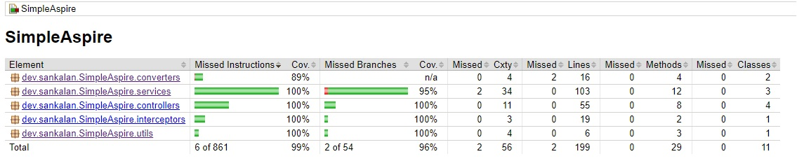

# Simple Aspire
### Problem statement
*"It is an app that allows authenticated users to go through a loan application. It doesn’t have to contain too many fields, but at least “amount
required” and “loan term.” All the loans will be assumed to have a “weekly” repayment frequency.
After the loan is approved, the user must be able to submit the weekly loan repayments. It can be a simplified repay functionality, which won’t
need to check if the dates are correct but will just set the weekly amount to be repaid."*

### Tech choices
- Java with Springboot and H2 database.
- Junit for unit-testing, Springboot test for integration testing.
- Jacoco for measuring code coverage.

### Users
Users are pre-created. There is no functionality to add a new user. There are three users created at application startup-
| Username        | Password           | Role  |
| ------------- |:-------------:| -----:|
| admin      | admin | ADMIN |
| user1      | user1      |   USER |
| user2 | user2      |    USER |

In case you need any other user account, edit `data.sql` (src/main/resources) accordingly and restart the application.

### Assumptions
- The application doesn't persist data. It uses an DB to store data in memory only.
- [Basic authentication]([https://swagger.io/docs/specification/2-0/authentication/basic-authentication/#:~:text=Basic%20authentication%20is%20a%20very,%2Dencoded%20username%3Apassword%20string.) used with the above mentioned credentials to authenticate and authorise users. All the endpoints are safe-guarded. Haven't used Spring security for this rather implemented simple interceptor to perform authentication and inject user context to request.
- ADMIN can view all loans while an USER can fetch only his/her loans.
- Only ADMIN can approve a loan.
- An unapproved loan can't be paid for.
- Any one can pay for a loan. Assumed that it is not necessary to implement user check while paying the loan. However, if required this can be implemented very easily as done in GET loan api.
- Any loan has an `AMOUNT` field which is equal to the loan amount opted for. It also has an `OUTSTANDING` field to reflect the current outstanding amount.
- Repayment schedule also has `AMOUNT` and `OUTSTANDING` field with same concept.
- Any loan payment amount has to be >= `outstanding` amount of next repayment schedule.
- If a loan repayment amount is > `outstanding` amount of next repayment schedule, the excess amount is **adjusted** with the upcoming repayment schedules (if any)
- Currency numbers are by defualt **rounded** to 2 decimal points. However if required the rounding of numbers can be turned off by setting the property `simple-aspire.use-unrounded-amount` to true in `application.property` (src/main/resources/)

### High level code structure
The code is mainly divided into these components

- **Interceptors**: Have only one interceptor that intercepts the requests, fetches the auth header and authenticates the user. On successful authentication, it sets the user context to the request. In case of failures it throws `401` with appropriate message.
- **Controllers**: Authenticatred requests are handled here. It uses the `services` to take care of the request as per business logic.
- **Services**: Hosts the different business logics. Uses `repositories` to perform DB operations.
- **Repositories**: Wrappers to provide CRUD operations on DB. Extends `CrudRepository` of Spring.
- **Models**: POJO objects.

### APIs

| API                    | REST Verb | Path               | Purpose              | Authorisation                                                         | Request body                        | Response                                                                                    | Error Conditions                                                                                       |
|------------------------|-----------|--------------------|----------------------|-----------------------------------------------------------------------|-------------------------------------|---------------------------------------------------------------------------------------------|--------------------------------------------------------------------------------------------------------|
| Create Loan            | POST      | /loan              | Creates a loan       | Any authenticated user can create a loan                              | { "amount" : double, "term" : int } | **Response Body**: {}, **Response Code**: 201,  **Response Header**: `Location` header is set with loan ID | **400**: Invalid input (amount and term should be > 0),   **401**: Auth failed,  **500**: Authenticated user is invalid or server |
| Get Loans              | GET       | /loans             | Get loans            | ADMIN can GET all loans, USER can GET only the loans belonging to him |                                     | **Response Body**: List of Loans **Response code**: 200                                             |    **401**: Auth failed,  **500**: Authenticated user is invalid or server error                                                   |
| Approve Loan           | POST      | /loan/{id}/approve | Approve a loan       | Only ADMIN can approve any loan                                       |                                     | **Response code**: 200                                                                          |     **401**: Auth failed,    **403**: Non ADMIN user cannot approve a loan, **404**: Loan not found,    **406**: Loan not in PENDING status,      **500**: Server error                    |
| Repay Loan installment | POST      | /loan/{id}/pay     | Pay loan installment | Any authenticated user can repay any loan                             | { "amount": double }                | **Response code**: 200                                                                          |**400**: Invalid repayment amount, amount should be >= next outstanding ,   **401**: Auth failed,   **404**: Loan not found,    **406**: Loan not APPROVED,    **409**: Loan already PAID,    **500**: Server error   |

### Testing

- Unit tests added (/src/test/java/dev/sankalan/SimpleAspire/)
- Integration test added (/src/test/java/dev/sankalan/SimpleAspire/integration)
- Jacoco used to measure code coverage

### How to run
*(Required: JDK 17+)*
- **Build**: `./gradlew build`
- **Test**: `./gradlew test` (Coverage report should be available at: /build/reports/jacoco/test/html/index.html)
- **Run**: `./gradlew bootRun` (Runs on Default port 8080)
- **Run with custom port**: `./gradlew bootRun --args='--server.port=<PORT NUMBER>'`
  
**Postman Collection** : */postmanCollection/SimpleAspire.postman_collection.json*
